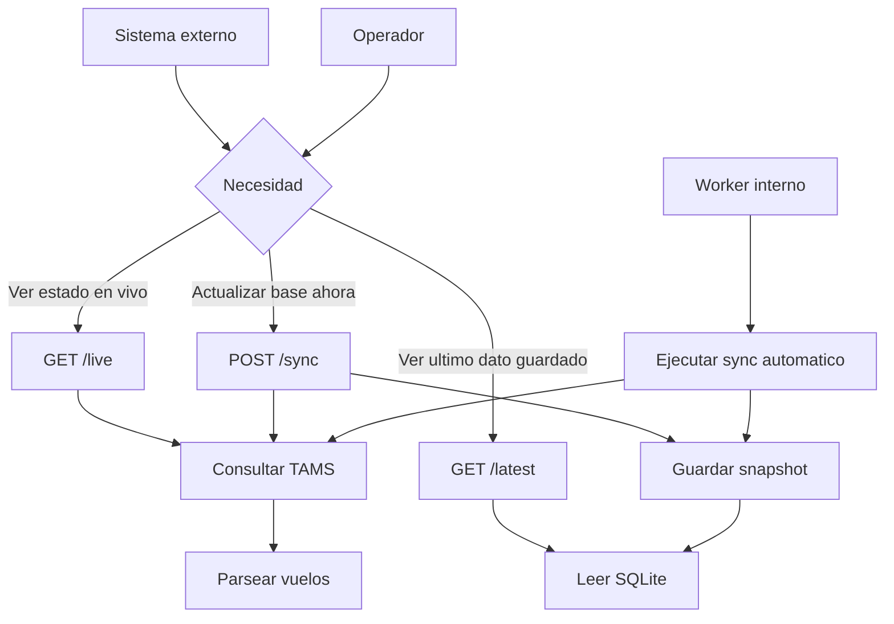
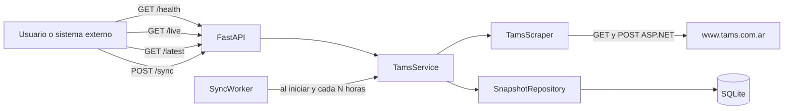
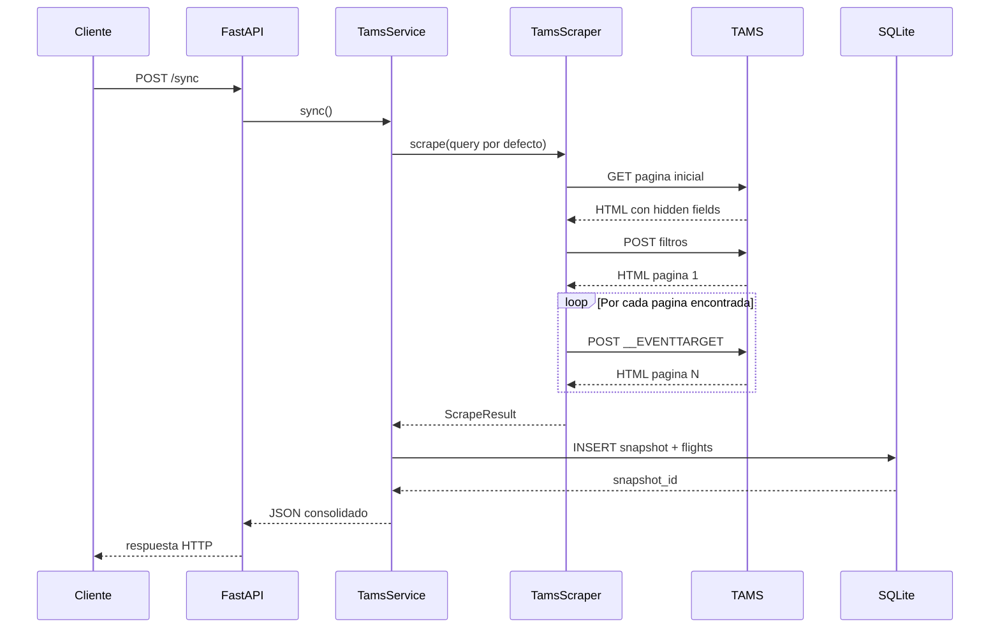

# Python TAMS Microservice

Este servicio expone una API en `FastAPI` para consultar vuelos desde `http://www.tams.com.ar/organismos/vuelos.aspx`, normalizar la informacion y guardar snapshots historicos en SQLite.

## Objetivo del sistema

El sistema resuelve tres cosas:

- consultar el sitio de TAMS/AA2000 con filtros configurables
- obtener todas las paginas de resultados
- persistir snapshots de vuelos para poder consultar el ultimo estado guardado

Ademas, incorpora un worker en background que ejecuta una sincronizacion automatica al iniciar y luego cada cierta cantidad de horas.

## Que problema resuelve

El sitio origen permite ver informacion operativa de vuelos, pero no esta pensado como una API para integraciones ni para historico. Este servicio actua como una capa intermedia para:

- exponer la informacion por HTTP en formato JSON
- centralizar una consulta con filtros controlados
- desacoplar consumidores del HTML del sitio origen
- conservar snapshots para consulta posterior

## Actores del sistema

| Actor | Necesidad | Endpoint o mecanismo |
| --- | --- | --- |
| Sistema externo | Leer vuelos actuales en formato JSON | `GET /live` |
| Sistema externo | Leer el ultimo estado persistido | `GET /latest` |
| Operador o integracion | Forzar una captura inmediata | `POST /sync` |
| Proceso interno | Mantener la base actualizada automaticamente | `SyncWorker` |

## Caso de uso principal

Caso de uso: disponer de una API simple para consultar vuelos y mantener un historico minimo del ultimo estado capturado.

Flujo esperado:

1. El servicio inicia.
2. Se ejecuta una sincronizacion automatica si `TAMS_RUN_ON_STARTUP=true`.
3. El worker repite la sincronizacion cada `TAMS_SYNC_HOURS`.
4. Los consumidores consultan `/latest` para obtener el ultimo snapshot ya persistido.
5. Si se necesita una lectura instantanea contra el sitio origen, se usa `/live`.
6. Si se necesita actualizar el historico en ese momento, se usa `/sync`.

## Casos de uso frecuentes

### 1. Consulta operativa en tiempo real

Un sistema cliente necesita ver el estado actual de vuelos con los filtros configurados o con filtros enviados en la request.

Se usa:

- `GET /live`

Resultado:

- consulta directa al sitio origen
- no escribe en base de datos
- devuelve el JSON armado al momento

### 2. Consulta del ultimo estado consolidado

Un dashboard o una integracion necesita una respuesta rapida sin depender de que el sitio origen este disponible en ese instante.

Se usa:

- `GET /latest`

Resultado:

- lee desde SQLite
- devuelve el ultimo snapshot persistido
- si no hay datos, responde `404`

### 3. Sincronizacion manual

Un operador o proceso necesita actualizar la base inmediatamente, sin esperar la proxima corrida automatica.

Se usa:

- `POST /sync`

Resultado:

- consulta el sitio origen
- guarda snapshot y vuelos en SQLite
- devuelve el mismo contenido guardado

### 4. Sincronizacion automatica

La aplicacion debe mantenerse actualizada sin intervencion manual.

Se usa:

- `SyncWorker`

Resultado:

- corre al iniciar si esta habilitado
- luego espera la cantidad de horas configurada
- ante error, no tumba la API y reintenta en el siguiente ciclo

## Mapa funcional



## Arquitectura



## Como funciona

1. La aplicacion carga configuracion desde variables de entorno.
2. Inicializa la base SQLite y crea las tablas si no existen.
3. Inicia `FastAPI` y levanta un `SyncWorker` en background.
4. Cuando se llama `/live` o `/sync`, el servicio arma una consulta `TamsQuery`.
5. El scraper hace un `GET` inicial para obtener los campos ocultos del formulario ASP.NET.
6. Luego hace un `POST` con los filtros y recorre la paginacion usando `__doPostBack(...)`.
7. Cada fila del HTML se transforma en un `FlightRecord`.
8. Las fechas de la fuente se convierten a UTC para que el dato quede consistente.
9. Si el endpoint fue `/sync`, el resultado se guarda en SQLite en las tablas `snapshots` y `flights`.
10. Si el endpoint fue `/live`, el resultado se devuelve pero no se persiste.

## Cuando usar cada endpoint

| Necesidad | Endpoint recomendado | Motivo |
| --- | --- | --- |
| Saber si la API esta levantada | `GET /health` | No depende de TAMS ni de SQLite |
| Obtener informacion actual directamente del origen | `GET /live` | Hace scraping en el momento |
| Obtener el ultimo estado guardado | `GET /latest` | Respuesta mas estable y rapida |
| Actualizar la base en este instante | `POST /sync` | Fuerza scraping y persistencia |

## Flujo de sincronizacion



## Componentes principales

| Componente | Responsabilidad |
| --- | --- |
| `AppConfig` | Carga variables de entorno y define la consulta por defecto |
| `TamsQuery` | Representa los filtros que se envian al formulario remoto |
| `TamsScraper` | Hace requests, parsea HTML, sigue paginacion y arma los vuelos |
| `SnapshotRepository` | Crea tablas, inserta snapshots y recupera el ultimo guardado |
| `TamsService` | Orquesta scraping, persistencia y respuesta final |
| `SyncWorker` | Ejecuta sincronizaciones periodicas en background |

## Persistencia

La base de datos se crea automaticamente en `TAMS_DB_PATH`.

### Tabla `snapshots`

Guarda el encabezado de cada captura:

- `id`
- `captured_at_utc`
- `source_updated_at_utc`
- parametros de consulta (`movement_type`, `airport_code`, `sector`, `airline_code`, `landed_filter`, `window_hours`)
- `total_flights`
- `total_pages`
- `source_url`
- `source_title`
- `notams_message`

### Tabla `flights`

Guarda el detalle de cada vuelo asociado a un snapshot:

- `snapshot_id`
- `row_number`
- `airline_code`
- `flight_number`
- `scheduled_raw`
- `scheduled_at_utc`
- `aircraft_registration`
- `position`
- `estimated_raw`
- `actual_raw`
- `terminal`
- `sector`
- `belt`
- `lf`
- `origin`
- `via`
- `remark`
- `sanitary`
- `passengers_raw`
- `passengers`

Relacion: un registro en `snapshots` tiene muchos registros en `flights`.

## Endpoints

| Metodo | Ruta | Que hace | Persiste |
| --- | --- | --- | --- |
| `GET` | `/health` | Devuelve estado de la API y timestamp UTC | No |
| `GET` | `/live` | Consulta TAMS en tiempo real y devuelve el resultado | No |
| `GET` | `/latest` | Devuelve el ultimo snapshot guardado | Ya persistido |
| `POST` | `/sync` | Consulta TAMS usando la configuracion por defecto y guarda el snapshot | Si |

### `GET /live`

Acepta parametros opcionales para sobreescribir la consulta por defecto:

- `movement_type`
- `airport_code`
- `sector`
- `airline_code`
- `landed_filter`
- `window_hours`

`window_hours` esta validado entre `-48` y `48`.

Ejemplo:

```powershell
curl "http://localhost:8000/live?movement_type=A&airport_code=AEP&window_hours=6"
```

### `POST /sync`

No recibe parametros en el endpoint actual. Usa los valores configurados en `AppConfig.load()` y guarda el resultado.

Ejemplo:

```powershell
curl -X POST "http://localhost:8000/sync"
```

### `GET /latest`

Devuelve el ultimo snapshot persistido. Si todavia no existe ninguno, responde `404` con:

```json
{
  "detail": "No hay snapshots guardados."
}
```

## Estructura de la respuesta

Los endpoints `/live`, `/sync` y `/latest` devuelven un JSON con esta forma general:

```json
{
  "snapshot_id": 123,
  "captured_at_utc": "2026-03-20T18:00:00+00:00",
  "source_updated_at_utc": "2026-03-20T17:55:10+00:00",
  "query": {
    "movement_type": "A",
    "airport_code": "AEP",
    "sector": "-1",
    "airline_code": "-1",
    "landed_filter": "TODOS",
    "window_hours": 6
  },
  "total_flights": 42,
  "total_pages": 2,
  "source_url": "http://www.tams.com.ar/organismos/vuelos.aspx",
  "source_title": "AA2000 Organismos",
  "notams_message": null,
  "flights": [
    {
      "row_number": 1,
      "airline_code": "AR",
      "flight_number": "1234",
      "scheduled_raw": "20/03 15:30",
      "scheduled_at_utc": "2026-03-20T18:30:00+00:00",
      "aircraft_registration": "LV-ABC",
      "position": "12",
      "estimated_raw": "",
      "actual_raw": "",
      "terminal": "A",
      "sector": "NAC",
      "belt": "3",
      "lf": "",
      "origin": "COR",
      "via": "",
      "remark": "",
      "sanitary": "",
      "passengers_raw": "120",
      "passengers": 120
    }
  ]
}
```

Notas:

- `captured_at_utc` es el momento en que el servicio hizo la captura.
- `source_updated_at_utc` es la fecha de actualizacion que informa TAMS.
- `scheduled_at_utc` se calcula a partir de `scheduled_raw` y de la zona horaria configurada.
- En `/live`, `snapshot_id` llega como `null` porque no hay persistencia.

## Configuracion

Variables de entorno soportadas:

| Variable | Default | Uso |
| --- | --- | --- |
| `TAMS_BASE_URL` | `http://www.tams.com.ar/organismos/vuelos.aspx` | URL de origen |
| `TAMS_TIMEZONE` | `America/Argentina/Buenos_Aires` | Zona usada para interpretar fechas de la fuente |
| `TAMS_SYNC_HOURS` | `6` | Frecuencia del worker en background |
| `TAMS_RUN_ON_STARTUP` | `true` | Ejecuta un sync automatico al iniciar |
| `TAMS_DB_PATH` | `./data/tams_flights.db` | Ruta del archivo SQLite |
| `TAMS_MOVEMENT_TYPE` | `A` | Valor por defecto del filtro |
| `TAMS_AIRPORT_CODE` | `AEP` | Valor por defecto del filtro |
| `TAMS_SECTOR` | `-1` | Valor por defecto del filtro |
| `TAMS_AIRLINE_CODE` | `-1` | Valor por defecto del filtro |
| `TAMS_LANDED_FILTER` | `TODOS` | Valor por defecto del filtro |
| `TAMS_WINDOW_HOURS` | `6` | Ventana horaria por defecto |

Ejemplo:

```powershell
$env:TAMS_SYNC_HOURS="12"
$env:TAMS_RUN_ON_STARTUP="false"
$env:TAMS_AIRPORT_CODE="EZE"
$env:TAMS_DB_PATH="C:\data\tams_flights.db"
uvicorn main:app --host 0.0.0.0 --port 8000
```

## Instalacion

```powershell
cd .\python_service
python -m venv .venv
.\.venv\Scripts\activate
pip install -r requirements.txt
```

## Ejecucion

Modo desarrollo:

```powershell
uvicorn main:app --reload --host 0.0.0.0 --port 8000
```

Modo normal:

```powershell
uvicorn main:app --host 0.0.0.0 --port 8000
```

Swagger UI queda disponible en:

- `http://localhost:8000/docs`
- `http://localhost:8000/redoc`

## Consideraciones operativas

- El scraper depende de la estructura HTML del sitio remoto. Si TAMS cambia IDs, nombres de campos o paginacion ASP.NET, habra que ajustar el parser.
- El worker captura excepciones para no tirar abajo la API, pero los errores quedan solo por `print`.
- La API trabaja en UTC internamente para evitar inconsistencias entre horarios de origen y horarios de almacenamiento.
